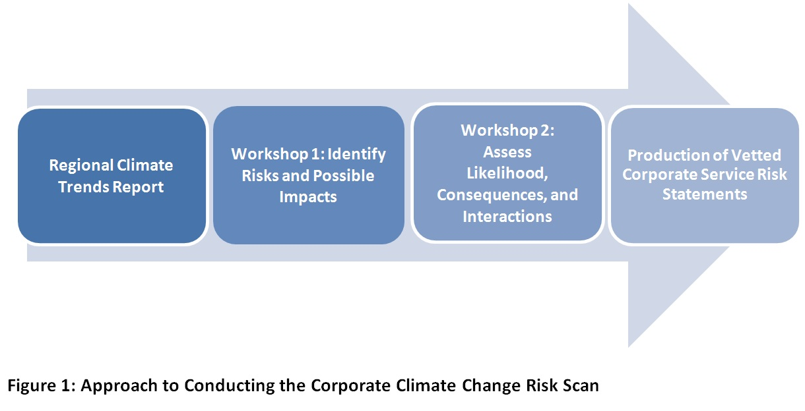

---
title:
author: "Alex Filazzola"
date: "2018"
output:
  html_document:
    theme: flatly
    toc: no
  pdf_document:
    toc: no
---
   

### Approach for Conducting a Corporate Risk Scan for Climate Change

[Ontario Climate Consortium](https://climateconnections.ca/)  

1.   Background and Project Objectives
The Town of Richmond Hill retained the Ontario Climate Consortium Secretariat (OCC) to perform a Corporate Climate Change Risk Scan over the fall months of 2017. Staff from the Sustainability team and the OCC engaged over 100 representatives from all Richmond Hill divisions and shared available projections of future changes in climate conditions specific to the town. The representatives discussed perceived risks to municipal operations, built consensus among their groups, and ultimately ranked their division specific risks based on likelihood of occurrence and severity of consequences. This information is being used to inform the development of a climate change action framework.
The objectives of the conducted risk assessment were:
	To better understand the impacts of climate change on municipal operations at both a corporate and divisional level;
	To raise awareness and establish an internal dialogue on climate change; and
	To potentially inform a future climate change action framework for the Town.
2.   Approach and Methodology
Staff from the OCC and the Town of Richmond Hill collaborated to bring together divisions from across the municipality to engage in discussions about climate change and the potential risks it poses to operations and service delivery. The OCC leveraged data on future climate projections for York Region that are expected to affect Richmond Hill (see Appendix A for a summary of climate information used in workshop settings).  Figure 1 below illustrates the overall approach followed throughout this project.
 

2.1   Workshop 1
In November 2017, representatives from each division participated in Workshop 1. This workshop set the context for the project, and presented available climate information for York Region. Staff were provided a list of 11 climate conditions that are expected to impact York Region from the York Region Climate Trends Report. The climate conditions are: more heat waves, higher average temperatures, extended spring and fall seasons, more dry spells, more freeze-thaw cycles, ice storms, extreme events and intense rainfall, more rain and snow in the winter, wetter spring and fall, and higher wind speeds (refer to appendix A).  Using the climate conditions presented, participants were guided through two workshop activities with co-facilitators from both the Town of Richmond Hill and the Ontario Climate Consortium to accomplish the following:
	Brainstorm risk statements for climate change on their services and operations; and
	Identify related divisions that may need to be aware of particular risks of climate change.
Staff from the Town of Richmond Hill was asked to brainstorm and document risks of climate change using a consistent format, specifically using an “If-Then-So” methodology. This methodology is consistent with traditional risk-based approaches where the “if” is associated with a particular event (in this case, a climate condition or extreme event occurring); the “then” is associated with a particular impact as a result of the event occurring; and the “so” is the ultimate implication to a particular service provided by the staff who identified it. An example is provided below:
If more extreme rainfall events occur, then this may lead to more frequent drainage or erosion issues, so this may ultimately require increased maintenance on trail infrastructure and raise costs.”  
All information brainstormed and documented within Workshop 1 was then analyzed through an integrated risk management approach by the OCC and the Town of Richmond Hill Sustainability team, and was then summarized and used to spur conversations in Workshop 2. 
2.2   Workshop 2
In December 2017, representatives from each division re-convened to participate in Workshop 2. The purpose of this workshop was to remind staff of the project approach, present a high level summary of the risks identified in workshop 1, and to use analyzed information from workshop 1 to:
	Assign likelihoods of the events taking place to each risk at present and in the future, and 
	Assess severity of consequences in order to prioritize the risks that climate change may bring to the corporation. 
Risks to climate change were assessed for the present time period and out to mid-century (2050s). All future risks were assessed assuming a “business as usual” approach to reducing greenhouse gas emissions, which according to the Intergovernmental Panel on Climate Change, is where greenhouse gas emissions are trending towards. Each identified risk was determined by relating the consequences (see Appendix B) of a particular climate risk on the corporation to the likelihood of the risk occurring, based on climate data for York Region. Specifically, the following equations were used to rank and prioritize risk following workshop 2 input: 
Current Climate Risk=Current Likelihood × ∑▒〖Consequences (across all categories) 〗  
Future Climate Risk=Future Likelihood × ∑▒〖Consequences (across all categories)  〗  
A risk was then determined to be cross-cutting based on higher consequences on the corporation (e.g., consequences to finance, infrastructure, people, and other categories as summarized in Appendix B). 
Additionally, in each workshop a list of potential mitigation and adaptation measures were generated from a brainstorming session within each division (see Appendix C). These ideas included suggested improvements on current operations and proposed solutions to reduce the consequences of the listed climate risks. The suggested mitigation and adaptation strategies were screened for duplicates and a summary generated based on repeated themes within the comments. 
