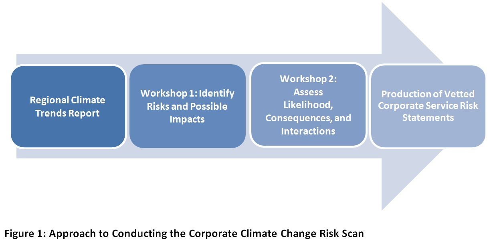

# Approach for Conducting a Corporate Risk Scan for Climate Change

[Ontario Climate Consortium](https://climateconnections.ca/)  

###  Background and Project Objectives

The objectives of this risk assessment are:

 + To better understand the impacts of climate change on operations at both a corporate and divisional level;
 + To raise awareness and establish an internal dialogue on climate change; and
 + To potentially inform a future climate change action framework for the corporate

Approach and Methodology

The OCC encourages each corporation to bring together departments/divisions to engage in discussions about climate change and the potential risks it poses to operations and service delivery. The OCC leverages data on future climate projections for speicifc Regions that are expected to affect the corporation. Figure 1 below illustrates the overall approach followed throughout this project.
 
 

### Workshop 1
Representatives from each division participate in Workshop 1. This workshop sets the context for the project, and presented available climate information for the region. Staff are provided a list of climate conditions that are expected to impact the region by 2050. The climate conditions include some of the following: more heat waves,  extended spring and fall seasons, more dry spells, more freeze-thaw cycles, more ice storms, more intense rainfall, and higher wind speeds. Using the climate conditions presented, participants are guided through two workshop activities with facilitators from both the corporate to accomplish the following:
	+ Brainstorm risk statements for climate change on their services and operations; and
	+ Identify related divisions that may need to be aware of particular risks of climate change.
	
Staff from the corporation are asked to brainstorm and document risks of climate change using a consistent format, specifically using an “If-Then-So” methodology. This methodology is consistent with traditional risk-based approaches where the “if” is associated with a particular event (in this case, a climate condition or extreme event occurring); the “then” is associated with a particular impact as a result of the event occurring; and the “so” is the ultimate implication to a particular service provided by the staff who identified it. An example is provided below:

> If more extreme rainfall events occur, then this may lead to more frequent drainage or erosion issues, so this may ultimately require increased maintenance on trail infrastructure and raise costs.”  

All information brainstormed and documented within Workshop 1 is then analyzed through an integrated risk management approach by the OCC and is summarized to spur conversations in Workshop 2. 

### Workshop 2

Representatives from each division re-convene to participate in Workshop 2. The purpose of this workshop is to remind staff of the project approach, present a high level summary of the risks identified in workshop 1, and to use analyzed information from workshop 1 to:

+ Assign likelihoods of the events taking place to each risk at present and in the future, and 
+ Assess severity of consequences in order to prioritize the risks that climate change may bring to the corporation. 
	
Risks to climate change are assessed for the present time period and out to mid-century (2050s). All future risks are assessed assuming a “business as usual” approach to reducing greenhouse gas emissions, which according to the Intergovernmental Panel on Climate Change, is where greenhouse gas emissions are trending towards. Each identified risk is determined by relating the [consequences](./consequenceDef.pdf) of a particular climate risk on the corporation to the likelihood of the risk occurring, based on climate data for the region. Specifically, the following equations are used to rank and prioritize risk following workshop 2 input: 

A risk is then determined to be cross-cutting based on higher consequences on the corporation (e.g., consequences to finance, infrastructure, people, and other categories). Additionally, in each workshop a list of potential mitigation and adaptation measures is generated from a brainstorming session within each division. These ideas include suggested improvements on current operations and proposed solutions to reduce the consequences of the listed climate risks. 
